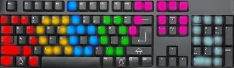

# raboms
raboms - radio buttons made simple / radio botonera muy simple



# English Version of README

raboms is a program to launch sounds and playlists by keyboard.
its made with the objective to be simple to use and simple to develop.
therefore it uses javascript and the javascript-sound-api and works
with every modern browser on any system.

the focus of development lies on comunity radios using free software,
especially for the distribution of GNU etertics.
as such the recommended operating system is linux and
all bash-scripts like filemanager (to get easier access to your files, as browsers dont have access to your filesystem)
are written to work in linux-systems in mind. maybe they work on mac,
maybe they wont. i dont care.

# How to install

you can install raboms via apt, via *git*, download latest debian from our repo or download a zipped release from this repository.
the git-version is always the most advanced, whilest the debian-repository is the most recommended as it gets auomatic actualization with your system-actualizations.

## git
just open a terminal (does not need root or sudo) and put:
```
git clone https://github.com/gaenseklein/raboms
```
after that (on linux) you can run the install-script to place starters in your start-menu:
```
sh raboms/install.sh
```
else you can start raboms with `sh raboms/raboms.sh` and the (english) config with `sh raboms/raboms-config-en.sh`

## deb
without sudo, but as root: (etertics...)
```
wget -q -O - https://raboms.gaenseklein.net/debian/KEY.gpg | apt-key add -
```
with sudo: (linux mint, ubuntu...)
```
sudo wget -q -O - https://raboms.gaenseklein.net/debian/KEY.gpg | sudo apt-key add -
```
this installs our public key. after that add our repository:
(sudo-users put a sudo in front, else execute as root)
```
echo "deb https://raboms.gaenseklein.net/debian/ /" > /etc/apt/sources.list.d/raboms.list
```

now as root or with sudo in front you can install raboms with:
```
apt-get update
apt-get install raboms
```

# filemanager

As browsers dont have direct access to your filesystem we have to let raboms know where your mp3-files are stored. therefore a shell-script runs before the start of raboms to search for all mp3 and ogg files stored in the selected directorys and its subdirectorys.
this part you can configure via a script - the config-script.
As this process is rather fast if you dont let it search for your whole disc (like putting /home as starting point) we run it every time on startup.
Searching for id3-tags is more time-consuming so it should be started manualy once and every time you add new files you want to use and find via id3-tag.
you can do that by starting raboms via terminal
(`sh ~/raboms/raboms-scanid3.sh` if installed by git or simply `raboms-scanid3` if you installed the debian package) or select the last option in the configuration-dialog.  
