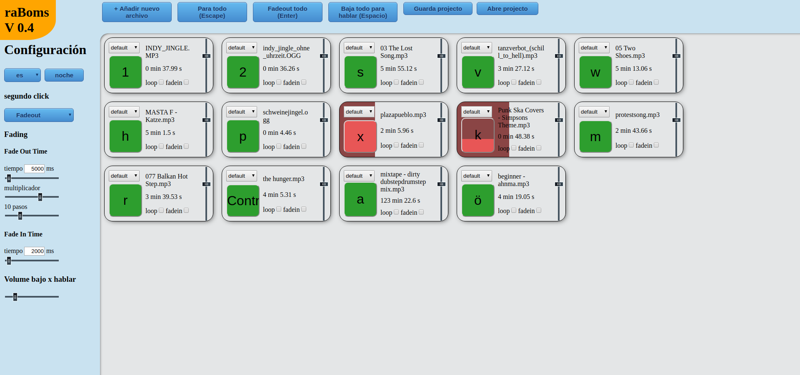

# raboms
raboms - radio buttons made simple / radio botonero muy simple



raboms es un botonero para radios, creado para la comunidad de radio-y-software-libre, hecho simple con html5 y javascript.

El gól de ese programa es facilitar a radios comunitarias que quieren hacer programa en vivo con un botonero, tener una opción facil y liviano. 
Primero intentamos hasta donde podemos llegar asi no más con puro html y javascript, en el futuro quiza usar electron para unas configuraciones mas avancadas y evitar las problemas de Javascript con datos locales.

# como instalar

## linux / con filemanager
Abre un terminal y ponga 
```
git clone https://github.com/gaenseklein/raboms
```
eso copia todo el projecto del repositorio a la carpeta "raboms" en tu directorio de home.

Despues pongas 
```
sh raboms/install.sh
```
eso abre el script de instalación, que te copia una entrada a tu menu del desktop para abrir el programa directamente de alli y usar el filemanager para eligir tus archivos. 
despues de eso puedes eligir si quieres abrir la configuración para configurar las carpetas en donde tiene que buscar el script de inicio del filemanager para buscar tus mp3 y ogg.

## todos demas / sin filemanager
En la carpeta "releases" estan las ultimas versiones. Guarda la version ultima en tu compu, ábrelo y ya lo puedes usar directamente. 
la version más actual: [actual.tar.gz](releases/actual.tar.gz)
último release: [raboms version 0.5](releases/0.5.zip)

# filemanager
El camino de programar eso con javascript tiene una desventaja grande: Javascript - o mejor el navegador - no tiene accesso a tu sistema de archivos. Por eso en la version sin filemanager lo tienes que escribir la ruta completa a la carpeta donde esta el archivo que quieres usar para un boton. 
El filemanager es la solución para tod@s usarios de linux, porque el script de inicio busca todos mp3 y ogg para el javascript y les pasa ese información. Asi en el navegador/javascript se puede eligir casi como lo estas acostumbrado y ya contiene toda la información.
El problema de eso es que el proceso de inicio se puede tardar mucho. Si no configuras en la instalación se busca en tu carpeta "home" y en la carpeta "media" para discos externos. 
Si yo inicio así no mas con mi disco externo de 2TB se tarda casi 2 minutos o más para arancar. Eso es normal, tambien que no te dice nada en ese tiempo cuando esta buscando. Hay que esperar. 
El proceso del inicio se puede hacer más rapido cuando configuras el filemanager para que solo busca en rutas que de verdad tienen tus mp3s. Por ejemplo si tu musica esta en /home/usario/musica - eliges este carpeta para buscarlo. Si tus efectos estan en /home/usario/efectos añadis ese carpeta tambien. 

## configurar el filemanager
Se puede configurar de dos formas:
1. con el script "config"
2. editando el archivo "rutas.cfg" con un editor de texto como xed, pluma, leaf, nano o que te gusta. 

### el script config
Abre un terminal y ponga 
```
sh raboms/config.sh
```
Aqui puedes eligir si quieres borrar o añadir una nueva ruta. 
Si eliges añadir una ruta, se abre una ventana de eligir archivos. En ese ventana eliges la carpeta que quieres asumar al proceso de busqueda y ya. 
Si eliges borrar se abre una nueva ventana en que eliges la ruta que no quieres buscar más.
Cuando estas listo puedes salir del script o eligier a iniciar raboms

### archivo rutas.cfg
Si quieres editar las rutas por tu mismo es facil igual. Solo abre el archivo rutas.cfg y ponga las carpetas que quieres usar por alli. Por cada carpeta pongas una linea. Si quieres buscar por ejemplo en /home/usuario/musica y /home/usuario/entrevistas el archivo parece asi:
```
/home/usuario/musica/
/home/usuario/entrevistas/ 
```

# idioma/language

Lo hacemos en dos idiomas - ingles como idioma internacional y castellano porque es el idioma principal de nuestra comunidad. Si quieres añadir otro idioma - bienvenido :)

# Eligir salida / placa de audio

Aunque ya esta instalado parece dificil lograrlo. La documentación no esta claro por alli. 
Lo que encontré que dicen es: 

## Firefox:

Abrir el "about:config", buscar por "sinkid" y activar el "media.setsinkid.enabled" (cambiarlo a true). 
A mi no cambió nada por mala suerte... no me deja leer los dispositivos/enumerarles...

## Chromium:

El chromium se ve mis salidas/dispositivos, pero cuando lo quiero cambiar me da un error que faltan permisos para hacerlo. 

## conclusión:

Si alguien encuentra una solución como activarlo por favor escribanme y lo pongo por aqui como lograrlo.
Si no - quiza cuando cambiamos a electron podemos lograrlo. 

# Disfrutalo no más :)


